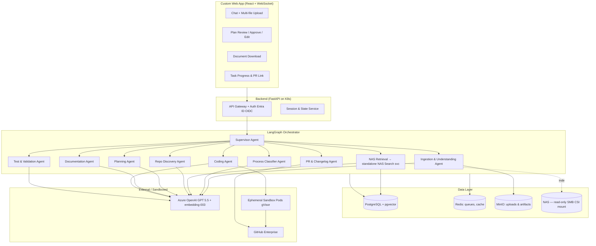
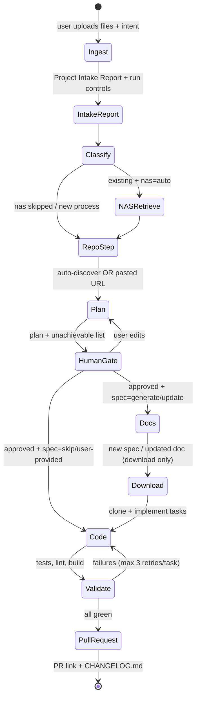

# DocForge — Multi-Agent Process Change Platform: Architecture Design

**Version:** 1.3 | **Status:** Updated — service decomposition, configurable pipeline, intake report, Entra ID | **Date:** July 2026

---

## 1. Overview

**DocForge** is a Kubernetes-hosted, multi-agent platform that lets a user chat and upload heterogeneous project documents (PPTX, DOCX, TXT, XLSX, images), determines whether the request targets a **new process** or a **change to an existing process**, enriches context from a NAS document repository, locates or accepts the associated GitHub repository, produces a human-approved execution plan (including an explicit list of unachievable tasks), generates or updates the process documentation, then autonomously implements the code changes, validates them, and raises a pull request with a `CHANGELOG.md`.

Two cross-cutting properties define the v1.3 design: **the pipeline is configurable per run** — NAS search, tech-spec generation, and repo discovery can each be skipped or satisfied by user-provided inputs (an uploaded spec, a pasted repo URL) — and **capabilities are packaged as reusable services**, most notably NAS Search, which ships as a standalone API with its own chat frontend usable across the org independently of DocForge (§4.6). Immediately after ingestion, DocForge presents a **Project Intake Report** (§5, step 2) summarizing what it understood, what's missing, and the proposed flow, before any downstream work begins.

**Orchestration framework: LangGraph** (chosen over Semantic Kernel and AutoGen). Rationale: first-class support for cyclic stateful graphs, durable checkpointing (survives pod restarts — essential because the human approval gate may stay open for hours or days), native `interrupt()` primitives for human-in-the-loop gates, and clean integration with Azure OpenAI. Fully open source, no Hugging Face dependency.

### Confirmed requirements

1. **NAS:** 2,000–3,000 documents, accessed over SMB. The platform builds and maintains its own semantic index; the NAS is mounted **strictly read-only — the platform never writes to it**.
2. **GitHub:** GitHub Enterprise Cloud (github.com/enterprise), accessed via a GitHub App / service account. The agent runs tests locally in the sandbox before pushing; existing CI runs again on the PR as usual.
3. **Document delivery:** All generated and updated documents are delivered to the user as **downloads only**. Placing an updated document back on the NAS is a human action outside the platform.
4. **Tech-spec template:** An official template exists and will be provided; it will be onboarded as a docxtpl template (see §4.5).
5. **Scale:** 50–100 users within a single org, with headroom to scale further inside the org (see §9 sizing).

---

## 2. Constraint Compliance

| Constraint | How the design complies |
|---|---|
| Only Azure GPT 5.5 + Azure embedding-003 | All reasoning, vision, and code generation via Azure OpenAI GPT 5.5 (which is multimodal, so images are handled without any separate vision model). All embeddings via Azure text-embedding-003. |
| No Hugging Face | No HF hub, transformers, or HF-hosted models anywhere. OCR fallback uses Tesseract (Apache 2.0). Rerankers/classifiers are implemented as GPT 5.5 prompt patterns instead of cross-encoder models. Container images pulled from a private registry with an allow-list to enforce this. |
| Open source everything else | LangGraph, FastAPI, React, PostgreSQL + pgvector, Redis, MinIO, Apache Tika, Tesseract, gitpython, docxtpl, Langfuse, Prometheus/Grafana, Argo Workflows. Authentication uses the org-standard Azure Entra ID (OIDC) — not self-hosted. |

---

## 3. High-Level Architecture

---

## 4. Component Design

### 4.1 Web Application (React + FastAPI)

Single-page app with four panes: conversational chat with drag-and-drop multi-file upload (streamed to MinIO via presigned URLs, 200 MB/file cap); a **Project Intake Report card** shown after ingestion with per-step **run controls** (skip NAS search, skip or self-upload the tech spec, paste a repo URL to skip discovery — see §5a); a plan-review pane rendering the generated plan as editable task cards with an explicit "Unachievable" section; and a progress pane streaming agent status over WebSocket, ending with document download links and the PR URL. Authentication via the org-standard **Azure Entra ID (OIDC)**; the GitHub identity used for PRs is a service account, with the requesting user recorded in the PR body for traceability.

### 4.2 Agent Inventory

All agents are LangGraph nodes sharing one typed state object, checkpointed to PostgreSQL after every node so any failure resumes from the last completed step.

| Agent | Responsibility | Key tools / notes |
|---|---|---|
| **Supervisor** | Routes the graph, enforces gates, aggregates errors, emits UI events. | Deterministic routing where possible; LLM routing only for ambiguity. |
| **Ingestion & Understanding** | Parses every upload into normalized markdown + structured metadata; produces the **Project Intake Report** (§5, step 2) covering what was understood, what's missing, and a proposed process flow. | Apache Tika for detection; python-pptx / python-docx / openpyxl for native parsing; GPT 5.5 vision for images and embedded diagrams; Tesseract as deterministic OCR fallback for scanned pages. |
| **Process Classifier** | Decides *new process* vs *existing process change*; asks the user via chat if confidence is low. | GPT 5.5 with the brief + a lightweight embedding similarity check against the NAS index (a strong match to existing process docs is evidence of "existing"). |
| **NAS Retrieval (RAG)** | *(existing, skippable)* Thin client over the **standalone NAS Search service** (§4.6): retrieves the process's canonical documents; assembles the authoritative process context. | Hybrid search: pgvector cosine (embedding-003) + Postgres full-text (BM25-style); GPT 5.5 prompt-based reranking (no HF cross-encoders). Returns document paths, not just chunks, so the Documentation Agent knows which source document to base the updated version on. |
| **Repo Discovery** | *(existing only)* Maps the process to its GitHub repo. *(new)* Prompts the user for a repo URL and validates access. | Matches against a pre-built repo index (READMEs, repo metadata, CODEOWNERS, doc cross-references embedded with embedding-003). If confidence < threshold, presents top candidates for user confirmation rather than guessing. |
| **Planning** | Produces the task plan: ordered achievable tasks (with acceptance criteria and affected files) and a separate **unachievable list with reasons**. | Reads repo tree + key files; feasibility rules in §6. Output is a structured JSON plan rendered as editable cards. |
| **Human Approval Gate** | LangGraph `interrupt()`. User approves, edits tasks, or rejects; edits loop back through Planning for re-validation. | Durable — state persists indefinitely until the user acts. |
| **Documentation** | *(new)* Generates the technical specification DOCX from the org-provided template. *(existing)* Fetches the source process document from the NAS (read-only), produces an updated copy reflecting the approved plan, and exposes it as a download. **Never writes to the NAS.** | docxtpl / python-docx; output written to MinIO and served via a presigned download link; the original NAS file is untouched. |
| **Coding** | Clones the repo into an ephemeral sandbox pod, implements approved tasks one at a time on a feature branch, self-reviews diffs. | gitpython; per-task loop: implement → compile/lint → self-critique → next. Fully autonomous until PR per your selection. |
| **Test & Validation** | Detects and runs the repo's test suite (pytest/jest/maven/etc.), linters, and build; on failure, returns findings to the Coding agent (bounded retry loop, default 3 iterations per task). | Runs inside the same sandbox; results attached to the run record. |
| **PR & Changelog** | Generates/updates `CHANGELOG.md` (Keep-a-Changelog format), commits with conventional-commit messages, pushes branch, opens PR with plan summary, test results, and requester identity. | GitHub REST API via service account / GitHub App. |

### 4.3 NAS Indexing Pipeline (background, continuous)

An Argo Workflows cron pipeline mounts the NAS read-only via the SMB CSI driver, walks configured process-document roots, and incrementally indexes changed files (mtime + content hash): parse with Tika → chunk (heading-aware, ~800 tokens, 100 overlap) → embed with Azure embedding-003 → upsert into pgvector with metadata (path, process name, doc type, version, last modified). Deletions are tombstoned. This index serves both the Retrieval agent and the Classifier's similarity check. A parallel, much smaller pipeline indexes GitHub repo metadata for the Repo Discovery agent.

**Sizing:** at 2,000–3,000 documents the corpus is small — on the order of 100k–300k chunks. A single pgvector instance with an HNSW index handles this trivially (no dedicated vector database needed), a full reindex from scratch completes in hours and can run nightly, and incremental sync can run every 15–60 minutes. Embedding-003 cost for a full reindex of this corpus is negligible.

### 4.4 Tech-Spec Template Onboarding

The provided official template is converted once into a docxtpl template: placeholder fields (`{{ project_name }}`, `{{ scope }}`, repeating task tables, etc.) are inserted at the agreed locations while all corporate styling, headers/footers, and boilerplate remain byte-identical to the original. The Documentation agent fills it from the approved plan and the Process Understanding Brief. Template versions are stored in MinIO and referenced by ID, so the org can update the template without a code change.

### 4.5 Sandbox Execution
Each coding run gets an ephemeral Kubernetes Job in a dedicated namespace: gVisor (or Kata) runtime class, non-root, read-only root FS except the workspace volume, egress restricted by NetworkPolicy to GitHub, the internal package mirrors (PyPI/npm proxy via Nexus/Artifactory), and the Azure OpenAI endpoint only — Hugging Face domains are explicitly unreachable, which enforces the model constraint at the network layer, not just by convention. Pods are destroyed after the PR is raised; the workspace diff and test logs are archived to MinIO.

### 4.6 Service Decomposition & Reusability

DocForge is packaged as **four independently deployable containers** plus ephemeral sandbox Jobs. The decomposition rule: a capability becomes a standalone service when it has a consumer other than DocForge; otherwise it stays inside the core to keep the operational surface small for a 1–2 person team.

| Container | Contents | Reused by / notes |
|---|---|---|
| `docforge-web` | React SPA (chat, intake report, plan review, progress, downloads) | — |
| `docforge-core` | FastAPI gateway + LangGraph workers (two entrypoints, one image): supervisor, ingestion, classifier, planner, documentation, coding, validation, PR agents | Calls NAS Search over HTTP like any other client |
| `nas-search` | **Standalone service**: indexer (SMB walk → parse → chunk → embed → pgvector) + REST API — `/search` (hybrid retrieval), `/answer` (RAG answer with citations to file paths), `/documents/{id}` (metadata + fetch), `/index/status` — plus its own lightweight **NAS Chat frontend** served from the same container | **Org-wide asset.** Any team can point a UI or script at it to search and chat over NAS content. DocForge is just one client. Auth: Entra ID — user tokens (on-behalf-of) from frontends, client-credentials for service-to-service. Own Helm chart, own release cycle, own pgvector schema. |
| `sandbox-runner` | Coding sandbox image + in-pod runner | Ephemeral Jobs only |

Design consequences: the NAS Search API is versioned (`/v1`) and treats DocForge as an external consumer — no shared database access, no imported internals — which is what makes the "NAS chat for the org" use case free rather than a fork. Parsing code is shared as a Python package (`docforge-parsing`) consumed by both `docforge-core` ingestion and the `nas-search` indexer, so document-format fixes land in both. Anything else (doc generation, planning) stays in core until a second consumer actually appears — speculative service extraction is how two-person teams drown.

---

## 5. End-to-End Workflow

### 5a. Run Configuration — Skippable & Substitutable Steps

Every run carries a `RunConfig`, set from the intake report card (and adjustable until the plan-approval gate). LangGraph conditional edges route around skipped stages; skipped/substituted choices are recorded in the audit trail and echoed in the PR body.

| Step | Options |
|---|---|
| **NAS search** | `auto` (default for existing processes) · `skip` · effectively substituted when the user uploads the process docs themselves |
| **Tech spec** | `generate` (default for new processes) · `skip` (no document produced; plan alone drives coding) · `user_provided` (user uploads their own spec, which is ingested and becomes planning context instead of an output) |
| **Repo** | `auto_discover` (default for existing) · `manual` (user pastes the repo URL — discovery skipped entirely; URL validated for clone access and default branch) |

Guardrails: skipping never silently degrades the plan — if a skipped step leaves the planner without needed context (e.g., NAS search skipped and uploads don't describe the current process), the gap surfaces as an explicit item in the intake report and, if unresolved, in the unachievable list. Skips are one-click reversible until plan approval.

### 5b. Pipeline

Step details:

1. **Ingest & understand.** All uploads parsed into a normalized corpus.
2. **Project Intake Report** — presented to the user before anything else runs. Contents: **(a) inventory** — every file received, type, pages/slides/sheets, parse quality, and OCR-confidence flags for scanned content; **(b) understanding** — process-name candidates, systems and integrations mentioned, stakeholders, detected requirements, and a **proposed process flow** rendered as a simple diagram; **(c) completeness checks** — new-vs-existing signal, whether a repo is identifiable, whether a spec was supplied, contradictions between documents, and an explicit *missing-information list* with targeted questions; **(d) assessment** — rough complexity/risk rating and estimated task count; **(e) run controls** — the skip/substitute toggles from §5a. The user can answer the questions in chat, upload more files (report regenerates), adjust toggles, or proceed.
3. **Classify** new vs existing (low confidence → the intake report's questions already cover it; otherwise one clarifying question).
4. **Context enrichment.** Existing + `nas=auto`: the NAS Retrieval agent calls the NAS Search service for canonical process docs. Then repo resolution per config: auto-discovery with confidence-thresholded confirmation, or the pasted URL path.
5. **Plan.** Structured plan with ordered tasks (description, rationale, affected files, acceptance criteria, estimated risk) plus the **unachievable list** with concrete reasons per §6 — including gaps created by skipped steps.
6. **Human gate.** Approve / edit / reject; run-config still adjustable here.
7. **Documentation** (per config). `generate` → tech spec DOCX from the official template; existing-process change → updated copy of the NAS document; `user_provided` or `skip` → stage bypassed. All outputs are **download links only**; the NAS is never modified.
8. **Autonomous coding.** Feature branch; per-task implement → self-check loop; kill switch available throughout.
9. **Validation.** Full test suite + linters + build in the sandbox; bounded retries; persistent failures downgraded to "attempted — needs human attention" in the PR body.
10. **PR.** Branch pushed, `CHANGELOG.md` created/updated, PR opened with the approved plan, per-task status, test summary, doc link (if generated), the run-config choices, and the requesting user. Merging stays human.

---

## 6. Unachievable-Task Determination

A task lands on the unachievable list when it hits any of these rules, each reported with its reason:

1. **Out of repo scope** — requires changes to systems/repos outside the identified repository (e.g., a database owned by another team, a third-party SaaS configuration).
2. **Insufficient information** — uploads + NAS docs don't specify the requirement concretely enough to define acceptance criteria, and the user declined/failed to clarify.
3. **Missing access** — the service account lacks permissions (private submodule, protected resource, unreachable dependency mirror).
4. **Constraint violation** — the task would require forbidden tech (any non-Azure model, Hugging Face assets) or violates configured org policy.
5. **Non-code work** — inherently human tasks (stakeholder sign-off, procurement, production deployment approvals). These are listed as human follow-ups, not silently dropped.
6. **Verification impossible** — the repo has no way to validate the change (no tests and none can be reasonably created within scope); flagged as *achievable but unverifiable* — the user decides at the approval gate whether to proceed.

---

## 7. Data & State

PostgreSQL holds: run/session records, the LangGraph checkpoint store, plan versions and approval audit trail, the pgvector NAS index, and the repo index. Redis handles the task queue between the API layer and long-running graph workers plus WebSocket pub/sub. MinIO stores raw uploads, normalized parsed artifacts, generated documents, sandbox diffs, and test logs. Retention: uploads and artifacts default to 90 days; audit records (who approved which plan, which documents were generated and downloaded, PR links) are retained indefinitely.

## 8. Security & Governance

Org-standard Azure Entra ID (OIDC) for user authentication — user tokens at the frontends, on-behalf-of flow from web to APIs, client-credentials for service-to-service (core → NAS Search); per-run RBAC so a user only sees their own runs (team scopes via Entra groups later). Secrets (Azure OpenAI keys, GitHub App key, NAS credentials) in Kubernetes secrets backed by an external secret store (e.g., Azure Key Vault via External Secrets Operator). NAS mounted read-only cluster-wide with no write path anywhere — enforced at the CSI mount, and the NAS credential itself should be a read-only account so the guarantee holds even outside Kubernetes. All LLM calls, prompts, and tool invocations traced in Langfuse for auditability; Prometheus/Grafana for infrastructure metrics; per-run Azure token budget with alerting to contain cost. Prompt-injection defense: NAS/upload content is always framed as untrusted data in prompts, and the Coding agent's tool surface inside the sandbox is limited to the workspace (no cluster credentials present in the pod).

## 9. Kubernetes Topology

Namespaces: `platform` (UI, API, orchestrator workers), `data` (Postgres, Redis, MinIO — or managed equivalents), `indexing` (Argo cron pipelines), `sandbox` (ephemeral coding Jobs, gVisor runtime class, strict NetworkPolicies). Orchestrator workers are horizontally scalable KEDA-autoscaled consumers of the Redis queue; because state lives in the Postgres checkpointer, workers are stateless and interruption-safe.

**Sizing for 50–100 users:** realistically 5–15 concurrent active runs. Baseline: 2–3 API pods, 3–5 orchestrator workers (KEDA scales on queue depth), one modest Postgres instance (the vector index for 3k docs fits in memory), and sandbox Jobs created on demand — the sandboxes dominate resource usage, so a dedicated autoscaling node pool for the `sandbox` namespace keeps the platform core stable. The primary external bottleneck is the Azure OpenAI TPM quota; a per-run token budget plus a global rate limiter in front of the Azure endpoint prevents one large coding run from starving interactive chat. Scaling to several hundred users is a quota-and-replica change, not an architectural one.

## 10. Failure Handling

Every graph node is retried with exponential backoff on transient errors (Azure 429s, git network failures). Non-transient failures pause the run and notify the user in chat with a resume/abort choice — the checkpoint makes resume exact. Sandbox Jobs have hard CPU/memory/time limits (default 2h) to prevent runaway runs. If Repo Discovery or NAS Retrieval returns nothing above threshold, the system asks the user instead of proceeding on a guess — "ask, don't assume" is the default posture at every ambiguity point.

## 11. Phased Delivery Suggestion

**Phase 1 (MVP, ~6–8 wks):** chat + upload, ingestion, classifier, manual repo URL for all cases, planning + approval gate, spec generation, coding + tests + PR for a single language ecosystem. **Phase 2:** NAS indexing pipeline (small corpus — this phase is short), RAG retrieval, repo auto-discovery, updated-document generation for existing processes. **Phase 3:** multi-ecosystem test detection, Langfuse eval loops, team-level RBAC, plan-quality analytics.

## 12. Onboarding Actions (all prior open questions resolved)

Three concrete inputs are needed before build-out: (1) the official tech-spec template file, for one-time docxtpl conversion; (2) creation of a GitHub App in the enterprise org with `contents:write` and `pull_requests:write` scoped to the relevant repositories; and (3) a read-only NAS service account plus the list of process-document root paths to index.
